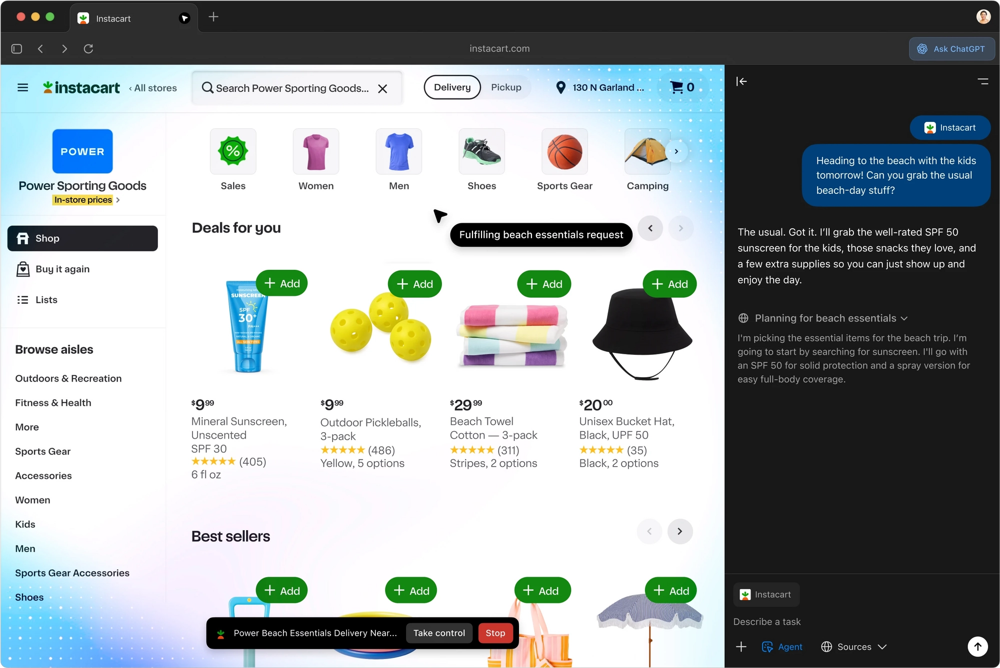
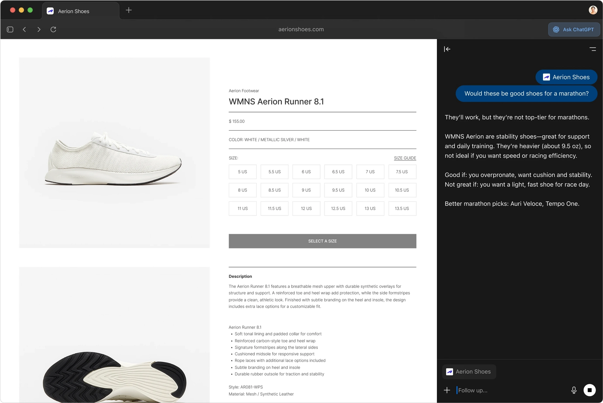
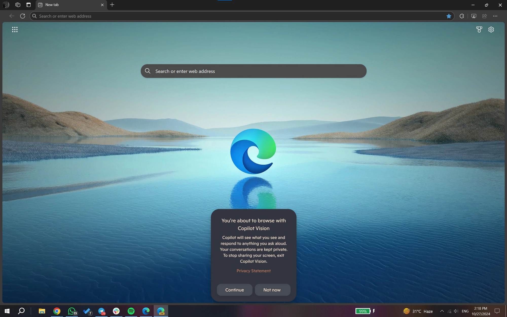
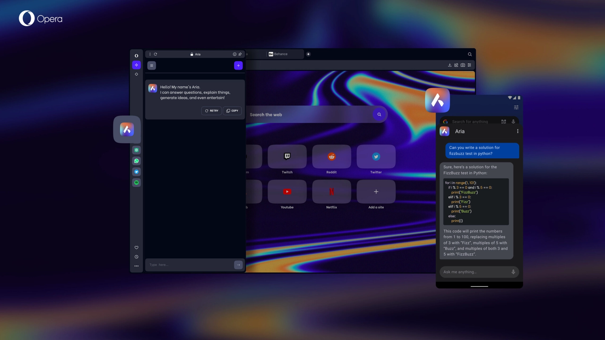
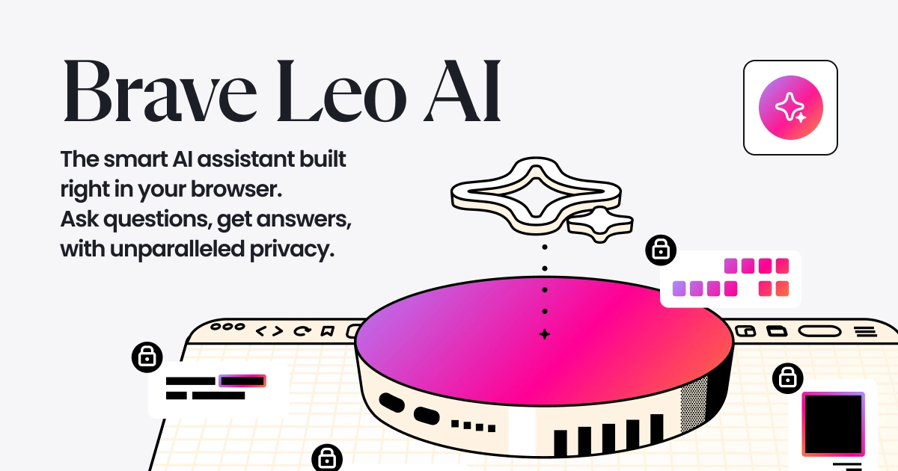
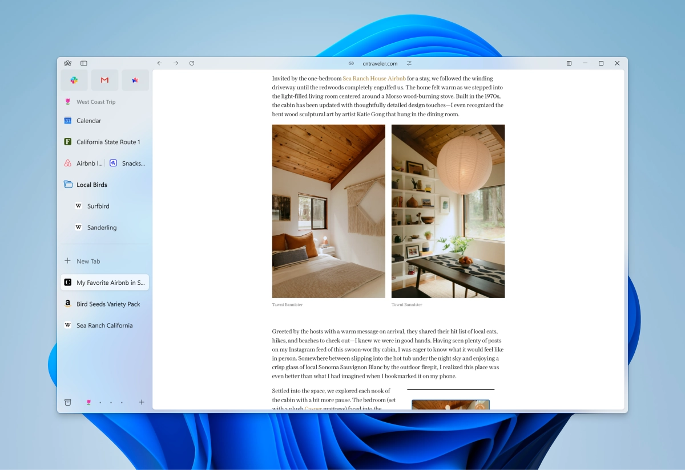
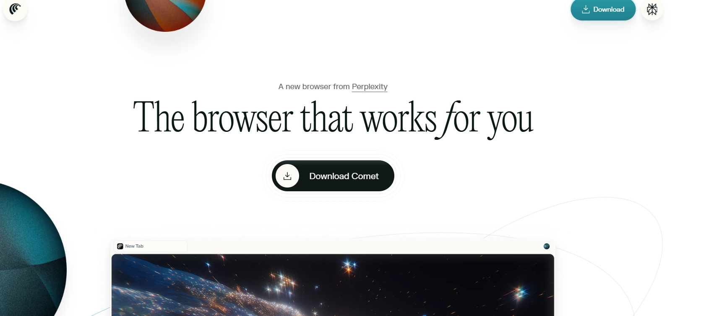
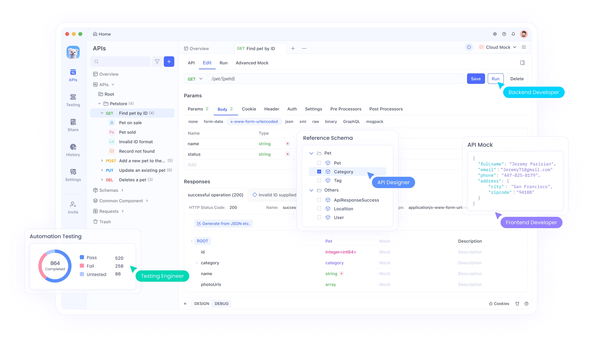

# 2025年Windows上最好用的OpenAI浏览器（Atlas）替代品

---

你可能听说OpenAI推出了ChatGPT Atlas浏览器——一个能实时总结网页、自动填表、智能搜索的AI原生浏览器。听起来很酷，但有个问题：它现在只支持macOS。如果你用Windows，要么等（不知道等到什么时候），要么找个现在就能用的替代品。好消息是，Windows上已经有一堆浏览器把AI功能做得相当不错，有些甚至在某些方面比Atlas更实用。

---

## Atlas到底是什么东西?

OpenAI把Atlas设计成一个"AI原生浏览器"——简单说就是把ChatGPT直接塞进浏览器里。你可以高亮一段文字让它解释，可以让它总结长文章，甚至可以让它帮你填表格。技术上讲，Atlas基于Chromium内核，但加了一层OpenAI自己的AI处理层，能理解网页内容的上下文。

它还挺注重隐私的——一些敏感查询会在本地设备上处理，不会传到外部服务器。性能方面，简单任务的AI响应延迟平均在500毫秒以内，这得益于优化过的边缘计算。

但问题来了：目前只有macOS版本，Windows用户只能干等着。而且如果你是重度用户，OpenAI的API调用可能会产生额外费用。对于需要立即使用AI浏览器的Windows用户来说，找替代品是唯一选择。

## 为什么Windows用户需要找替代品?

原因很直接：Atlas还没出Windows版本。但除了这个，还有其他考虑因素。

有些浏览器能更好地整合Windows特有功能，比如Cortana或Azure服务。性能优化也不一样——Windows机器通常用多核CPU，有些浏览器在这方面优化得更好。成本也是个因素，Atlas绑定OpenAI的订阅模式，而有些免费替代品功能一点不差。

对于开发者来说，浏览器能不能支持Chrome扩展很重要。比如你在用👉 [这个能让API调试效率翻倍的工具](https://pplx.ai/ixkwood69619635)，就需要浏览器支持扩展集成，这样才能在AI辅助浏览的同时监控API调用。

## 怎么评判一个替代品好不好?

主要看几个方面：AI集成的深度（能不能真正理解网页内容）、性能指标（页面加载速度、AI响应延迟）、Windows兼容性（包括对ARM架构的支持）。

功能集也很重要：总结准确度、自动化脚本、扩展生态。隐私控制、界面是否好用、社区支持力度、成本——这些都得考虑进去。

用这些标准，我们来看看几个最值得试的选项。

## Microsoft Edge + Copilot：Windows原生的最佳选择

Edge把Copilot（基于GPT-4和Bing搜索引擎）直接集成到浏览器侧边栏。你可以不用切换标签就能查询网页内容。技术上，Copilot用混合模式——轻量任务在本地处理，复杂分析交给云端，延迟低至200毫秒。

Edge基于Chromium，但加了Windows专属优化，比如通过DirectML在NVIDIA GPU上加速AI推理。你可以让Copilot总结页面、生成代码片段，甚至根据高亮文本写邮件。对开发者来说，Edge的DevTools扩展能监控AI驱动的Web应用。

跟Atlas比，Edge在企业环境更有优势——集成Azure AD，有合规认证。基准测试显示，Edge在执行AI任务时比Chrome少用20%的内存，特别适合Windows笔记本。缺点是收集的遥测数据比较多，不过可以在设置里关掉。

优点：免费、深度整合Windows系统。缺点：AI偶尔会出现幻觉（给出错误答案）。总体来说，Edge是生产力用户的强力选择。

## Google Chrome + Gemini：性能怪兽和生态系统

Chrome嵌入了Gemini（谷歌的多模态AI模型），能处理文本、图片和代码。Gemini可以生成图片描述，或者根据页面上下文优化查询。集成使用WebAssembly来高效执行AI，在Windows系统上开销很小。

Chrome的V8引擎为AI脚本优化了JavaScript，支持扩展Gemini功能的扩展。你可以通过地址栏或侧边栏召唤Gemini，它会分析标签页并建议操作，比如智能重组书签。性能测试显示，Chrome能处理的并发AI查询比Firefox多50%，不会变慢，这得益于线程渲染。

跟Atlas比，Chrome的扩展支持更广——商店里有超过20万个扩展。它还能跟Google Workspace无缝协作。缺点是资源占用高，AI功能可能会额外占用300MB内存。

不过，如果你已经深度使用谷歌生态系统，Chrome是个很有说服力的选择。

## Opera + Aria：创意工作流的创新功能

Opera集成了Aria（基于GPT技术的AI），帮助处理创意和研究任务。Aria出现在侧边栏，提供实时聊天、代码生成和内容改写。Opera基于Chromium定制的引擎，内置VPN和广告拦截器，在AI交互时增强隐私。

技术上，Aria用服务器端处理来保证准确性，查询采用端到端加密。你可以用它来头脑风暴或优化搜索，还能跟Opera的Flow功能集成实现设备同步。在Windows上，Opera针对触摸界面做了优化，适合平板电脑。

基准测试显示Aria的响应时间平均300毫秒，跟Atlas差不多。Opera的亮点是模块化工作区——可以按项目分组标签页，AI还会提供建议。限制是跟微软的集成不如Edge深。

但对于创意专业人士来说，Opera是个吸引人的替代品。

## Brave + Leo：注重隐私的AI浏览

Brave集成了Leo，一个强调隐私的AI助手，尽可能在本地处理查询。Leo能处理总结、问答和翻译，不会把数据发送给第三方。Brave的架构默认拦截追踪器，确保AI功能符合其隐私理念。

在Windows上，Brave用Rust编写安全组件，降低漏洞风险。你可以通过侧边栏访问Leo，它会安全地分析页面内容。性能方面，Brave消耗的带宽更少，适合按流量计费的连接，AI任务执行时间在400毫秒以内。

跟Atlas比，Brave的广告拦截更强，还有加密货币奖励，但AI模型在处理复杂任务时不够先进。开发者喜欢它干净的测试环境。

Brave适合优先考虑数据保护的用户。

## Arc Browser：Windows上的生产力设计

Arc Browser重新设计了标签管理，用空间和画板进行视觉组织。它的AI功能包括自动标签分组和内容提取，由集成模型驱动。Arc基于Swift的核心（通过自定义包装器移植到Windows）确保流畅性能。

你可以为工作和个人使用创建配置文件，AI会建议优化方案。在Windows上，Arc支持符合系统标准的键盘快捷键。基准测试显示启动速度比Chrome快，AI辅助导航能减少30%的点击次数。

跟Atlas比，Arc在UI创新上更出色，但缺少深度AI查询功能。它适合多任务处理者。

## Perplexity Comet：高级搜索和研究工具

Perplexity的Comet浏览器专注于代理搜索——AI代理执行多步骤查询。Comet集成Perplexity引擎，提供带引用的答案和可视化。它的架构使用WebGPU加速AI，兼容Windows硬件。

你输入自然语言搜索，Comet会编译带来源的结果。性能指标显示研究任务的响应时间在一秒以内。在Windows上，它支持扩展进一步定制。

跟Atlas比，Comet在信息查询的准确性上更出色，但通用浏览功能较少。研究人员会觉得它很有价值。

## 用Apidog增强这些浏览器

Apidog是个一体化API平台，通过Chrome扩展补充这些浏览器。扩展能捕获网络请求，让开发者在使用AI功能时实时调试API。比如在Edge里，Apidog能监控Copilot的后端调用。

安装很简单——从Chrome网上应用店添加扩展，然后跟Apidog桌面应用同步就能获得完整功能。这个设置支持模拟响应、测试端点、自动生成文档。

在Chrome或Opera里，Apidog无缝集成，增强AI自动化工作流。用户报告调试周期快了40%。作为免费工具，Apidog不花钱就能增加价值，是技术用户探索Atlas替代品时的必备工具。

---

## 结语

Windows用户不用等Atlas——现在就有一堆强大的AI浏览器可选。从Edge的企业级功能到Comet的研究能力，这些选项能在不妥协的情况下提升生产力。如果你是开发者，配合👉 [这个能让API开发效率翻倍的神器](https://pplx.ai/ixkwood69619635)使用，效果更好。选哪个取决于你的具体需求——隐私、性能、生态系统整合，或者创新UI。技术在进化，这些平台也会持续更新，值得关注。
